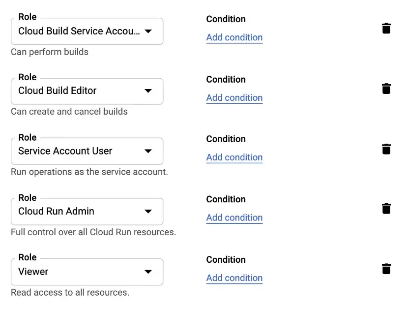

# GitHub Actions and Google Cloud Run example walkthrough

<!-- TOC -->

- [GitHub Actions and Google Cloud Run example walkthrough](#github-actions-and-google-cloud-run-example-walkthrough)
  - [what is this ?](#what-is-this-)
    - [what's in the box ?](#whats-in-the-box-)
    - [prerequisites](#prerequisites)
      - [gcloud CLI and GCP project setup](#gcloud-cli-and-gcp-project-setup)
  - [run and test locally](#run-and-test-locally)
  - [steps to deploy an app' on Cloud Run](#steps-to-deploy-an-app-on-cloud-run)
    - [manual deployment flow: from Docker image to Cloud Run](#manual-deployment-flow-from-docker-image-to-cloud-run)
      - [build and push your API image to Google Cloud Artifact Registry](#build-and-push-your-api-image-to-google-cloud-artifact-registry)
      - [deploy the image on Cloud Run](#deploy-the-image-on-cloud-run)
        - [a live deployment out of the box](#a-live-deployment-out-of-the-box)
    - [CI/CD](#cicd)
    - [tests](#tests)
    - [deployments](#deployments)

<!-- /TOC -->

## what is this ?

This repo aims at giving a walkthrough on how to deploy applications on Google Cloud Run using GitHub Actions. Here, we just deploy a very simple sample Flask app'.

### what's in the box ?

- an `app.py` containing the app' to deploy
- a `Dockerfile`, containing the image that we are to build from
- the CI/CD build steps in the `.github/workflows` folder

### prerequisites

- you use GitHub
- Docker Desktop
- have the `gcloud` CLI installed on your machine, and a GCP project set up
- OPTIONAL: having bought a domain name, preferably on Google Domains

#### `gcloud` CLI and GCP project setup

- `sudo apt update && sudo apt upgrade`
- [install](https://cloud.google.com/sdk/docs/install#deb) the `gcloud` CLI on your machine or run a `gcloud components update` to update your `gcloud` tools
- have a GCP project ready and make sure billing is enabled for it
- GCP APIs that must be enabled in your project (you can do this from your GCP browser console) =>
  - `Artifact Registry API`
  - `Cloud Build API`
  - `Compute Engine API`
  - `Container Analysis API`
- initialize, Cloud Build for your repo, you may need to [connect your GCP to GitHub](https://cloud.google.com/build/docs/automating-builds/github/connect-repo-github)
- initialize `gcloud` CLI => `gcloud init`
- then set the project ID => `gcloud config set project PROJECT_ID`
- set your default region, replacing the placeholders (without the `{}`, to replace with the relevant Google Cloud region, for instance `europe-west1`) => `gcloud config set run/region {gCloudRegion}`
- authenticate your local Docker install to Artifact Registry => `gcloud auth configure-docker {gCloudRegion}-docker.pkg.dev`
- create a Docker repository in the artifact registry

## run and test locally

- `docker build -t ghactions-example-local -f prod.Dockerfile .`
- run and check on localhost => `docker run -e PORT=5000 -p 80:5000 ghactions-example-local`
- test => `docker run ghactions-example-local bash -c "python test_flaskr.py"`

## steps to deploy an app' on Cloud Run

### manual deployment flow: from Docker image to Cloud Run

Manual deploys are useful during the development process, if you want to see the results live in dev or staging environment

#### build and push your API image to Google Cloud Artifact Registry

- build and tag the relevant Docker image locally => `docker build -t {gCloudRegion}-docker.pkg.dev/{projectId}/{nameOfTheArtifactRegistryRepo}/{nameOfYourContainer}:{tag} -f ./prod.Dockerfile .`
- create your repository in the Artifact Registry =>

```bash
gcloud artifacts repositories create {nameOfTheArtifactRegistryRepo} --repository-format=docker \
--location={gCloudRegion} --description="Docker repository for the {nameOfYourContainer} container"
```

- push the images to the Artifact Registry => `docker push {gCloudRegion}-docker.pkg.dev/{projectId}/{nameOfTheArtifactRegistryRepo}/{nameOfYourContainer}:{tag}`
- you might run into a permissions issue on push, if so, check that your Docker conf is wired to the Google artifact registry repositories => `cat ~/.docker/config.json`; it should look like so =>

```bash
 {
  "credHelpers": {
    "europe-west6-docker.pkg.dev": "gcloud",
    "gcr.io": "gcloud",
    "us.gcr.io": "gcloud",
    "eu.gcr.io": "gcloud",
    "asia.gcr.io": "gcloud",
    "staging-k8s.gcr.io": "gcloud",
    "marketplace.gcr.io": "gcloud",
    "europe-west1-docker.pkg.dev": "gcloud"
  }
}
```

#### deploy the image on Cloud Run

- to deploy from Dockerfile => `gcloud run deploy {serviceName-staging|prod} --image={gCloudRegion}-docker.pkg.dev/{projectId}/{nameOfTheArtifactRegistryRepo}/{nameOfYourContainer}:{tag} --port={portOfYourService} --allow-unauthenticated`
- for instance, staging env Cloud Run service name can be `ghactions-example-staging`
- if you have permissions issues because you are running this for the first time, just wait a few minutes and retry later
- when prompted, allow for unauthenticated invocations if it's a public API
- when app' deployed, the wizard should reveal the service URL that you can visit in your browser

##### a live deployment out of the box

When you deployed your Cloud Run instance, every revision that will make on it will have the same TLS protected URL out of the box ! This auto-generated URL is a safe place to test stuff in real world conditions, even in staging.
For instance, you could deploy a different service for each locale so you can try internationalization without even having to point any domain to the real thing ;)

### CI/CD

### tests

The `ci` workflow will run the tests on each push OR PR to `main` branch (your choice).

### deployments

GitHub Actions will create/update new revisions on release.

Also, the artifact registry repository must be created before the first deployment, as the `cd` workflow will push a new Docker image to the registry on each PR to `main` branch.
Finally, you need to create a service account on the GCP for the GitHub deployment action that will invoke Cloud Run with the following roles:



To be able to use the `cd` workflow, you need to create an environment called `live` in your repo' settings, and add the relevant secrets (check out the `cd` workflow file for more details).
